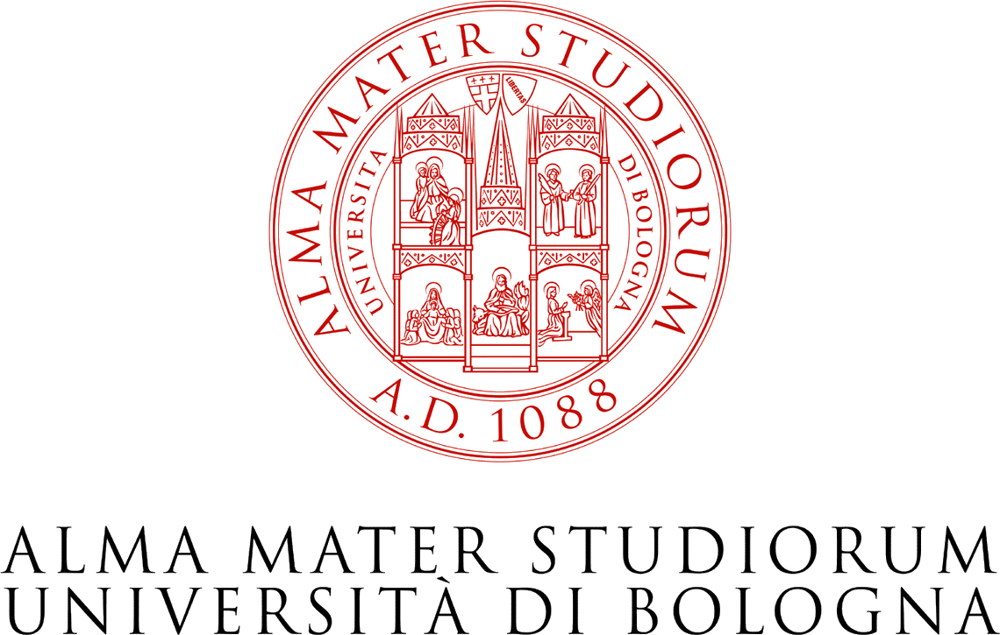

I am Professor of Demography at the  University of Bologna and an international co-investigator of the ESRC Research Centre on Micro-Social Change (MiSoC).

 I am the Principal investigator of the ERC Consolidator Grant [**GENPOP**](http://nicolabarban.com/genpop): **Genes, genealogies and the evolution of demographic change and social inequality**

 

## Projects:

* [**GENPOP**](https://github.com/nicolabarban/genpop) — Genes, genealogies and the evolution of demographic change and social inequality (ERC Consolidator Grant)
* [**demopast**](https://github.com/nicolabarban/demopast) — Historical Demographic Atlas of Italy
* [**newspop**](https://github.com/nicolabarban/newspop) — News scraper for fertility and demographic decline research using GDELT

## Research interests:

* Quantitative methods in social sciences.
* Sociogenomics
* Demography
* Social interactions
* Life course
* Migration and Ethnicity

Find my Curriculum Vitae here: [CV](Barban_cvOctober2020.pdf)
