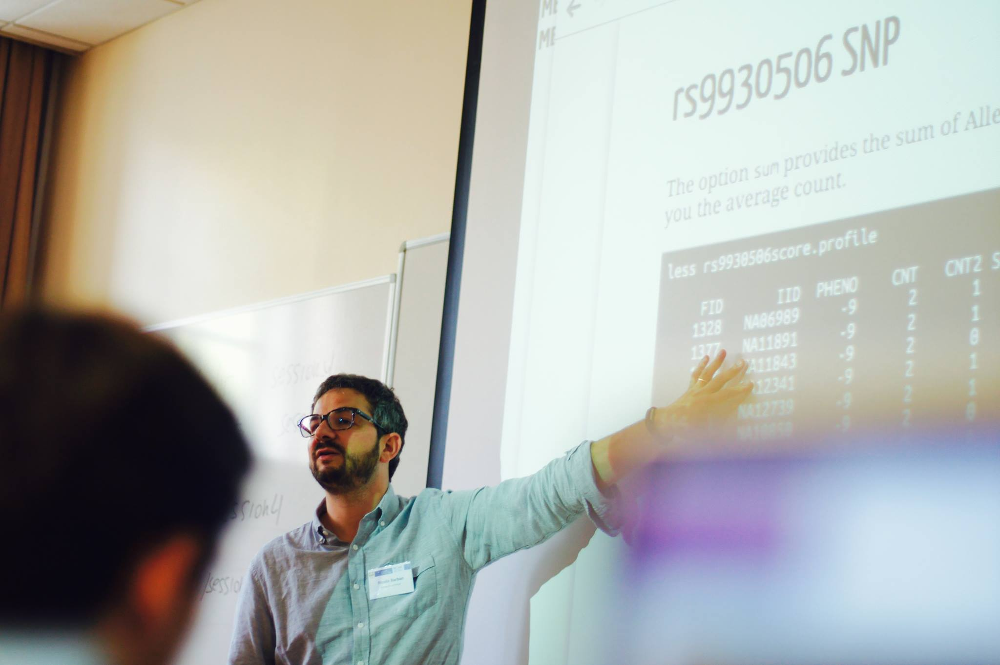

## 2021/2022
### [NCRM Course on sequence analysis] (http://nicolabarban.com/NCRM_sequence_analysis/) 

## 2020/2021
### **30060 - Laboratorio Bio-Demografico** 
 - [link to material](http://nicolabarban.com/LaboratorioBioDemografico2021/)
 -  [Link to online lectures](https://www.unibo.it/sitoweb/n.barban/didattica)
 
### **Conferenza Didattica Unipd** 
 - [link to material](http://nicolabarban.com/sequence_analysis/)

---
## Previous teaching:
*  **Demography** for the  BA in Human Sciences at the University of Oxford during the Michealmas and Hilary term 2016/2017.

*  [NCRM Oxford Socio-genetics Summer school](http://www.oxfordsociogenetics.com). 

* **Intermediate Quantitative Methods**.  MSc Sociology. University of Oxford.

* Selected lectures. **Life Course Research.** MPhil Sociology. University of Oxford.

* **Event history and Survival Analysis**. Research Master in Sociology, University of Groningen.

* **Sequence Analysis**. University Bicocca,  Milan. Pompeu Fabra University, Barcelona.  Spanish National Research Council (CSIC), Madrid. Instituto de Estadstica y Cartografa de Andaluca. Seville, Spain.

* **Introduction to Research Master**. University of Groningen.

* **Applied Statistics**. University of Groningen.

* **Quantitative Methods in Management**. Master of Science Economics and Management in Arts, Culture, Media and Entertainment, Bocconi University.
